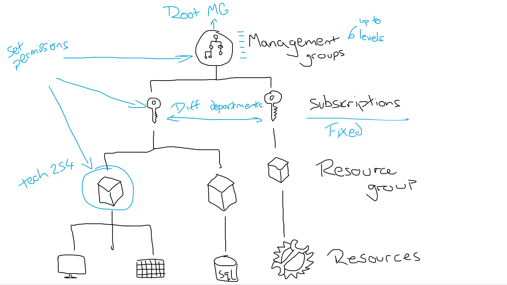

# Microsoft Azure

### Market Share of Azure

- Azure is the second leading cloud infrastructure organisation with 23% marketshare

### Extra Advantages of using the Cloud

- Scalability
- Security
- Disaster recovery
- Compliance
- Flexibility
- Cost efficiency
- Cost Savings

### Types of services offered by Azure

- AI Machine Learning
- Analytics
- Compute
- Containers
- Databases
- Developer Tools
- DevOps
- Hybrid + Multi-cloud
- Identity
- Integration
- Internet of Things
- Management and governance
- Media
- Migration
- Mixed reality
- Mobile
- Networking
- Security
- Storage
- virtual desktop infrastructure
- Web

https://azure.microsoft.com/en-gb/products

## The Structure of Azure

There are 4 main stages to the structure of Azure, starting from the bottom is the resources. This is stuf like your VM, databases, VPN (VPC). Anything you'd create, theses are all stored inside the next stage, resource groups. All resources have to be placed inside a group. This is the first stage of permission selecting who can interact with each resource group. The third stage is subscriptions, this is where you define how many resources you can have in each subscription. This is a hard limit and locked in, it cannot be changed. If you want more you have to create a new subscription, the other reason/benefit is that this determines the cost of resources meaning you can have different departments with different budgets on different subscription to manage their individual costs and better manage it. The final stage is Management groups, this can be up to 6 levels depending on the companies structure and who manages what areas, but at the very top is the root management group.

## Diagram of how a virtual machine works on Azure.

.png)

### System routes, what are they?

- Azure automatically creates system routes and assigns the routes to each subnet in a virtual network. You can't create system routes, nor can you remove system routes, but you can override some system routes with custom routes

#### what routes do they allow by default?

- Traffic within the virtual network
- Traffic to the Internet
- Traffic between different virtual networks using the Azure VPN Gateway
- Traffic from the virtual network to networks connected via the Azure VPN Gateway

### Differences between AWS and Azure

- Availability zones 
  - AWS - availability zones in a region - not limited to 3
  - Azure (AZ) - max of 3 availability zones
- The private subnet has access to internet to update on VM on Azure
- Azure has a set of default nsg rules that will allow all internal traffic unless stated otherwise.
- Azure Container is equivalent to AWS bucket.
