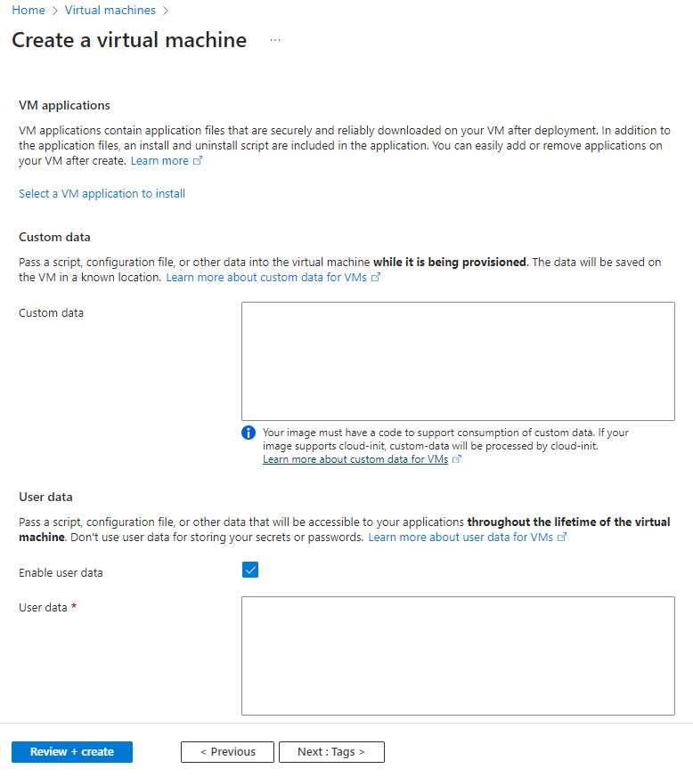

# How to create a Virtual Machine on Azure

1. Access the virtual machines page  
   1. Go to the Azure homepage.  
   2. In the top center, select the search bar and type in either "vm" or "virtual machine"
   3. Under services select Virtual Networks

2. Create a Virtual machine
   1. Select create
   2. Select Azure virtual machine

3. Fill out Basics (Part 1)
   1. Ensure that Resource group is "tech254" under subscription "Azure Training"
   2. Write in the name of virtual network (Note: use naming convention) 
   3. Ensure that Region UK South is selected
   4. Change security type to standard
   5. For Image select Ubuntu Pro 18.04 LTS (Gen 2)
      1. Find it in default
      2. Find it in drop down menu
      3. See all Images and search for it

4. Fill out Basics (Part 2)
   1. Size, choose Standard_B1s
      1. Find it as default
      2. See all sizes and search for it
   2. Authentication type is SSH
   3. Username change to "adminuser" (Provides better security avoiding default name)
   4. SSH public key source, choose exsisting key
   5. Stored keys, select your SSH key
   6. Select inbound ports, SSH (app+db), and HTTP (app)
   7. Next (Disks)

5. Fill out Disks
   1. Change OS disk type to Standard SSD
   2. Next (Networking)

6. Fill out Networking
   1. Virtual network, select your Virtual Network.
   2. Subnet, (public for app) (private for db)
   3. Public IP, (generate new ip for app) (None for db)
   4. NIC NSG, for app select basic and go to step v. for db select advance
      1. Configure NSG, new name
      2. Create new
      3. Add an inbound rule
      4. Destination port ranges (27017)
      5. Protocol (TCP)
      6. Name (Name after port and uses)
      7. Add
      8. OK
      9. Skip to step vi.

   5. Ensure inbound ports are same as before.
   6. "Delete public IP and NIC when VM is deleted", check the box
   7. Next (Management)

7. No set-up in Management so go Next to Monitoring
8. No set-up in Monitoring so go Next to Advance
9. Fill out Advance
   1. Enable User Data, check the box
   2. Paste in the User Data for VM
   3. Next (Tags)

10. Fill out Tags
    1. Name set to "Owner"
    2. Value set to your first name
    3. Go to Review + create
    
11. Review your settings to ensure they are correct.
12. Create

#### Blockers:
- When trying the User data that works on AWS, the shell script won't run. (Fixed)
  - So when you try to upgrade a manual input is required 
- Setting up the db vm, connecting to the app vm, post page was empty (Fixed)
    - In the app instance, `node seeds/seed.js` and `npm install`. This is to reload the seed set in db.
